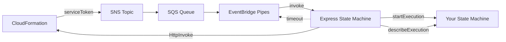

# AWS CDK Lambdaless Custom Resource

AWS CDK construct library for creating CloudFormation custom resources without Lambda functions, using Step Functions instead.

## Why?

When building custom resources with AWS CDK, Lambda functions are the standard approach. But Lambda runtimes reach end-of-life, and you'll start receiving EOL notifications for stacks you deployed long ago and forgot about.

If it's your own custom resource, you can update it. But what about custom resources embedded in construct libraries someone else wrote? When the EOL notice arrives, updating them can be a hassle.

This library uses AWS Step Functions instead of Lambda, eliminating runtime maintenance entirely. Step Functions has no runtime EOL — once deployed, it just works.

## When to use?

- Stacks you want to deploy and forget
- Sample code or workshops you publish and don't actively maintain
- Construct libraries you distribute to others

In these cases, using this library means neither you nor your users will ever receive Lambda runtime EOL notifications.

## How expressive is it?

Step Functions is less flexible than Lambda, but with [AWS SDK integrations](https://docs.aws.amazon.com/step-functions/latest/dg/supported-services-awssdk.html), [HTTP API calls](https://docs.aws.amazon.com/step-functions/latest/dg/connect-third-party-apis.html), and [JSONata expressions](https://docs.aws.amazon.com/step-functions/latest/dg/transforming-data.html), you can handle most use cases. See the [examples](#examples) for real-world patterns.

## Installation

```bash
npm install aws-cdk-lambdaless-custom-resource
```

## Usage

### Basic Example

```typescript
import { CustomResourceFlow, LambdalessCustomResource } from 'aws-cdk-lambdaless-custom-resource';
import { Pass, StateMachine, DefinitionBody } from 'aws-cdk-lib/aws-stepfunctions';
import * as cdk from 'aws-cdk-lib';

const flow = new CustomResourceFlow(this, 'ExampleFlow', {
  onCreate: Pass.jsonata(this, 'Create', {
    outputs: {
      PhysicalResourceId: 'example-id',
      Data: {
        message: '',
      },
    },
  }),
  onUpdate: Pass.jsonata(this, 'Update', {
    outputs: {
      Data: {
        message: '',
      },
    },
  }),
  onDelete: Pass.jsonata(this, 'Delete'),
});

const customResource = new LambdalessCustomResource(this, 'MyCustomResource', {
  stateMachine: new StateMachine(this, 'StateMachine', {
    definitionBody: DefinitionBody.fromChainable(flow),
  }),
  properties: {
    myProperty: 'Hello, World!',
  },
});

// Access custom resource attributes
new cdk.CfnOutput(this, 'Message', {
  value: customResource.getAttString('message'),
});
```

## Examples

See the [examples](./examples) directory for real-world patterns.

## ASL Templates

The [templates](./templates) directory contains the ASL (Amazon States Language) definition used by the internal orchestrator. This can be a useful reference when building your own state machines.

## State Machine Requirements

The state machine you pass to `LambdalessCustomResource` is invoked by the internal orchestrator whenever CloudFormation sends a Create, Update, or Delete event. You can use `CustomResourceFlow` to route these events, or build your own state machine from scratch.

### Input

Your state machine receives the following input. When using `CustomResourceFlow`, these are also available as variables (e.g. `$RequestType`).

| Variable | Description |
|---|---|
| `$RequestType` | `"Create"`, `"Update"`, or `"Delete"` |
| `$ResourceProperties` | Properties passed to the custom resource |
| `$OldResourceProperties` | Previous properties (Update only, otherwise `null`) |
| `$PhysicalResourceId` | Physical resource ID (Create: `null`) |
| `$LogicalResourceId` | Logical resource ID |
| `$StackId` | CloudFormation stack ID |
| `$RequestId` | Unique request ID |

### Output

Your state machine must return a JSON object. The orchestrator uses this to respond to CloudFormation on your behalf.

```json
{
  "PhysicalResourceId": "unique-id",
  "Data": {
    "key1": "value1",
    "key2": "value2"
  },
  "NoEcho": false
}
```

| Field | Required | Description |
|---|---|---|
| `PhysicalResourceId` | Yes (on Create) | Unique identifier for the resource. If omitted, `RequestId` is used. |
| `Data` | No | Key-value pairs accessible via `getAtt()` / `getAttString()`. Nested objects are flattened with dot notation. |
| `NoEcho` | No | If `true`, masks the output in CloudFormation events. Defaults to `false`. |

Access outputs in your CDK code:

```typescript
customResource.getAttString('key1')  // Returns 'value1'
```

## Architecture



## License

Apache-2.0
