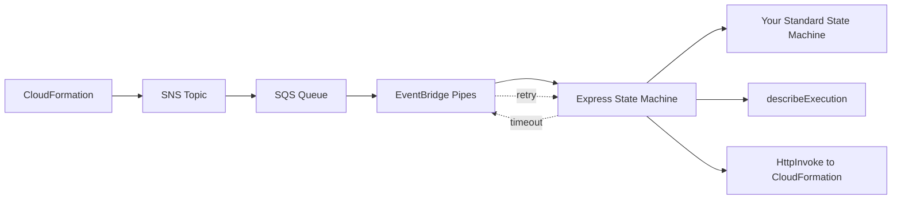

# AWS CDK Lambdaless Custom Resource

AWS CDK construct library for creating CloudFormation custom resources without Lambda functions, using Step Functions instead.

## Why?

Traditional CloudFormation custom resources require Lambda functions, which add runtime maintenance overhead. This library uses AWS Step Functions instead, eliminating Lambda entirely while supporting long-running workflows (up to 1 hour). Step Functions are serverless and require no runtime maintenance.

## Architecture



**Key Design:**
- Express State Machine times out after 5 minutes, but user-defined Standard State Machines can run longer
- On timeout, EventBridge Pipes retries the SQS message
- On retry, `describeExecution` finds the previous execution and responds to CloudFormation if completed
- Using `RequestId` as execution name ensures idempotency
- SQS default retention (4 days) is well beyond CloudFormation's max timeout (1 hour)

## Installation

```bash
npm install aws-cdk-lambdaless-custom-resource
```

## Usage

### Basic Example

```typescript
import { CustomResourceFlow, LambdalessCustomResource } from 'aws-cdk-lambdaless-custom-resource';
import { Pass, StateMachine, DefinitionBody } from 'aws-cdk-lib/aws-stepfunctions';
import * as cdk from 'aws-cdk-lib';

const flow = new CustomResourceFlow(this, 'ExampleFlow', {
  onCreate: Pass.jsonata(this, 'Create', {
    outputs: {
      PhysicalResourceId: 'example-id',
      Data: {
        message: '',
      },
    },
  }),
  onUpdate: Pass.jsonata(this, 'Update', {
    outputs: {
      Data: {
        message: '',
      },
    },
  }),
  onDelete: Pass.jsonata(this, 'Delete'),
});

const customResource = new LambdalessCustomResource(this, 'MyCustomResource', {
  stateMachine: new StateMachine(this, 'StateMachine', {
    definitionBody: DefinitionBody.fromChainable(flow),
  }),
  properties: {
    myProperty: 'Hello, World!',
  },
});

// Access custom resource attributes
new cdk.CfnOutput(this, 'Message', {
  value: customResource.getAttString('message'),
});
```

## Examples

- [Restrict default VPC security group](./test/integ.restrict-default-security-group.ts) - Revoke/authorize default security group rules using Step Functions

## Input

Your workflow receives the following input via `$states.input` (or as variables when using `CustomResourceFlow`):

| Variable | Description |
|---|---|
| `$RequestType` | `"Create"`, `"Update"`, or `"Delete"` |
| `$ResourceProperties` | Properties passed to the custom resource |
| `$OldResourceProperties` | Previous properties (Update only, otherwise `null`) |
| `$PhysicalResourceId` | Physical resource ID (Create: `null`) |
| `$LogicalResourceId` | Logical resource ID |
| `$StackId` | CloudFormation stack ID |
| `$RequestId` | Unique request ID |

## Output

Your workflow should return:

```json
{
  "PhysicalResourceId": "unique-id",
  "Data": {
    "key1": "value1",
    "key2": "value2"
  },
  "NoEcho": false
}
```

| Field | Required | Description |
|---|---|---|
| `PhysicalResourceId` | Yes (on Create) | Unique identifier for the resource. If omitted, `RequestId` is used. |
| `Data` | No | Key-value pairs accessible via `getAtt()` / `getAttString()`. Nested objects are flattened with dot notation. |
| `NoEcho` | No | If `true`, masks the output in CloudFormation events. Defaults to `false`. |

Access outputs in your CDK code:

```typescript
customResource.getAttString('key1')  // Returns 'value1'
```

## License

Apache-2.0
