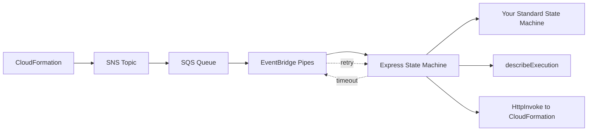

# AWS CDK Lambdaless Custom Resource

AWS CDK construct library for creating CloudFormation custom resources without Lambda functions, using Step Functions instead.

## Why?

Traditional CloudFormation custom resources require Lambda functions, which add runtime maintenance overhead. This library uses AWS Step Functions instead, eliminating Lambda entirely while supporting long-running workflows (up to 1 hour). Step Functions are serverless and require no runtime maintenance.

## Architecture



**Key Design:**
- Express State Machine times out after 5 minutes, but user-defined Standard State Machines can run longer
- On timeout, EventBridge Pipes retries the SQS message
- On retry, `describeExecution` finds the previous execution and responds to CloudFormation if completed
- Using `RequestId` as execution name ensures idempotency
- SQS default retention (4 days) is well beyond CloudFormation's max timeout (1 hour)

## Installation

```bash
npm install aws-cdk-lambdaless-custom-resource
```

## Usage

### Basic Example

```typescript
import { CustomResourceFlow, LambdalessCustomResource } from 'aws-cdk-lambdaless-custom-resource';
import { Pass, StateMachine, DefinitionBody } from 'aws-cdk-lib/aws-stepfunctions';
import * as cdk from 'aws-cdk-lib';

const flow = new CustomResourceFlow(this, 'ExampleFlow', {
  onCreate: Pass.jsonata(this, 'Create', {
    outputs: {
      PhysicalResourceId: 'example-id',
      Data: {
        message: '',
      },
    },
  }),
  onUpdate: Pass.jsonata(this, 'Update', {
    outputs: {
      Data: {
        message: '',
      },
    },
  }),
  onDelete: Pass.jsonata(this, 'Delete'),
});

const customResource = new LambdalessCustomResource(this, 'MyCustomResource', {
  stateMachine: new StateMachine(this, 'StateMachine', {
    definitionBody: DefinitionBody.fromChainable(flow),
  }),
  properties: {
    myProperty: 'Hello, World!',
  },
});

// Access custom resource attributes
new cdk.CfnOutput(this, 'Message', {
  value: customResource.getAttString('message'),
});
```

## Examples

See [examples](./examples) directory for more advanced use cases.

## API Reference

### `LambdalessCustomResource`

Creates a CloudFormation custom resource backed by Step Functions.

**Props:**
- `stateMachine` - The Step Functions state machine that implements the custom resource logic
- `properties` - Properties to pass to the workflow
- `serviceTimeout` - Maximum time for the custom resource operation (default: 3600 seconds)
- `resourceType` - Custom resource type name (default: `AWS::CloudFormation::CustomResource`)

### `CustomResourceFlow`

A Step Functions fragment that routes requests based on `RequestType` (Create/Update/Delete).

**Props:**
- `onCreate` - State machine fragment to execute on Create
- `onUpdate` - State machine fragment to execute on Update (optional)
- `onDelete` - State machine fragment to execute on Delete (optional)

**Available Variables:**
- `$RequestType` - "Create", "Update", or "Delete"
- `$ResourceProperties` - Properties passed to the custom resource
- `$OldResourceProperties` - Previous properties (Update only)
- `$PhysicalResourceId` - Physical resource ID
- `$LogicalResourceId` - Logical resource ID
- `$StackId` - CloudFormation stack ID
- `$RequestId` - Unique request ID

## Output Format

Your workflow should output:

```typescript
{
  PhysicalResourceId: 'unique-id',  // Required on Create
  Data: {                            // Optional
    key1: 'value1',
    key2: 'value2',
  },
  NoEcho: false,                     // Optional
}
```

Access outputs via `getAtt()` or `getAttString()`:

```typescript
customResource.getAttString('key1')  // Returns 'value1'
```

## License

Apache-2.0
